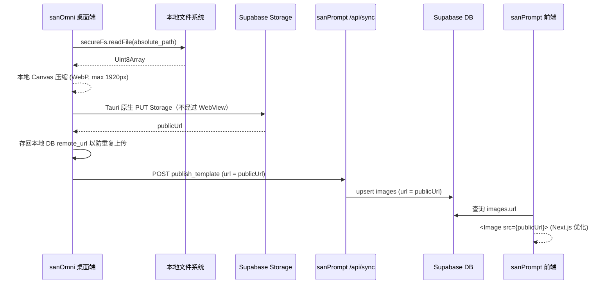

# Supabase Storage 模板图片上传方案

## 概述

sanOmni 在发布模板至 sanPrompt (web) 时，现已集成 Supabase Storage 直传方案。该功能取代了之前单纯传递本地文件名的逻辑，实现了自动压缩图片并直接上传云端，通过 public URL 供前端使用 Next.js 优化渲染。

## 核心流程图

## 关键设计与特性

### 1. 自动前端压缩降体积
为避免动辄 5MB 的原图撑爆 Supabase Storage 的免费额度，系统会在上传前自动对图片进行压缩：
- 利用浏览器原生的 `HTMLCanvasElement` 处理。
- 等比例缩放图片，确保长边最大不超过 `1920px`。
- 将图片转换为 `image/webp` 格式，设定 85% 画质。
- 平均将 5MB 图片缩小至约 150KB（压缩率近 95%）。

### 2. 存回本地防重复上传
当一张图片被成功上传后，不仅在当次 Payload 中向 Web 传递 public URL，更会在本地将其保存到 `image_prompt_group_relations` 表的 `remote_url` 字段。
- **效果**：下次用户修改文案再次更新模板时，因为本地 DB 中已存在 `remote_url`（且包含 Supabase 地址），系统会自动跳过图片上传流程，实现“秒传”，有效节省宽带与流量。

### 3. Next.js 智能图片优化
以前的模板图片全部使用了 `<Image unoptimized={isExternal} />` 以应对跨域图片加载问题。现在增加了智能判断逻辑：
- 如果图片的域名是 `.supabase.co` 或 `placehold.co`，则允许 Next.js 执行图片优化。
- 只有未知的外部 URL 才会依然触发 `unoptimized` 规避 404，从而保障云存储加载速度。

### 4. 优雅降级 (Opt-in)
如果在 sanOmni 的【设置 → sanPrompt】中未配置 Supabase URL 或 Storage Key，整个上传流程会静默跳过，不会阻断原有单纯同步数据的发布流程。

## 使用配置

1. 在 Supabase Dashboard 执行 `supabase/migrations/20260731_create_prompt_images_bucket.sql` 建桶。
2. 确保 `prompt-images` bucket 为公开读。
3. 在 sanOmni 设置中填写正确的 Supabase URL 及 Storage Key。该 Key 会迁移/保存到系统凭据库，上传由 Tauri 原生网络层执行，避免 WebView 的跨域限制。

## 配置持久化与缓存

`sanPromptSupabaseUrl` 是普通设置，写入 SQLite；Storage Key 是敏感值，仅保存在操作系统凭据库。启用了统一根目录时，sanOmni 会同时保存到两处数据库：

- 默认数据库：`%APPDATA%\com.sanomni.app\data\database.sqlite`，用于解析统一根目录。
- 当前统一根目录数据库：`<unifiedRootPath>\data\database.sqlite`，用于实际业务数据与配置读取。

WebView 的 `localStorage` 键 `ai-image-manager-settings` 只是界面缓存，不是 Supabase URL 的最终来源。客户端启动和打开“设置 → sanPrompt”时，都会用数据库中的 `sanPromptSupabaseUrl` 回填该缓存，防止旧缓存覆盖已经保存的 URL。

### 旧版客户端的表现与处理

旧版客户端可能出现“重启后设置框仍显示旧 URL，但数据库已是新 URL”的情况。此时：

1. 不要在显示旧值的旧版客户端直接点击“保存更改”，否则会把旧 URL 写回数据库。
2. 升级到包含数据库回填修复的客户端后，重新打开设置；界面会自动显示当前数据库值。
3. 若需要诊断，只读取两个 `settings` 表中的 `sanPromptSupabaseUrl`；不得在日志、截图或文档中输出 Storage Key。

上传配置由 Tauri 原生命令从数据库和系统凭据库读取。因此在上述旧缓存场景中，界面显示的旧 URL 不能作为实际上传目标的判断依据。
