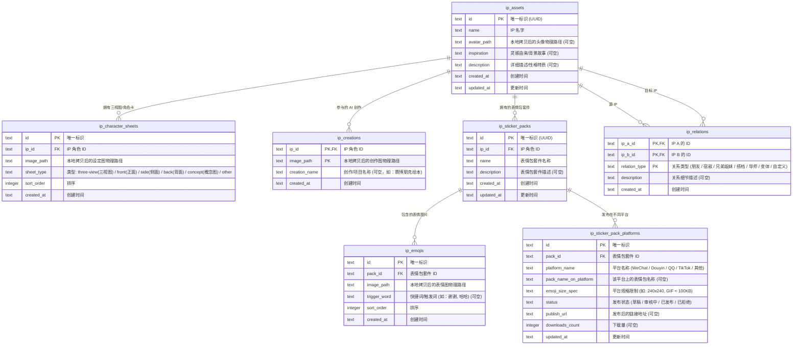

# AI IP 资产管理系统实施计划

本项目设计并规划了在 **sanOmni** 中整合 AI IP 形象资产管理系统的具体方案。该系统允许用户管理 AI 生成的 IP 角色、记录角色的背景故事与灵感由来、选择三视图/角色卡、分类关联相关的创作，并对角色生成的表情包进行分组管理，跟踪其在各个平台（如微信、抖音等）的发布规格和分发状态。

---

## 核心设计决策 (独立资源管理)

> [!IMPORTANT]
> **独立资源隔离**：IP 形象头像、三视图、参与作品和表情包图片均**不从**现有的待整理/归档媒体库中获取。它们是两个完全独立的部分。
> 
> **物理文件拷贝机制**：
> 1. 用户在前端触发添加操作时，会拉起操作系统的**原生文件选择器**（基于 Tauri `@tauri-apps/plugin-dialog`）。
> 2. 用户选定本地任意图片后，Tauri 后端会创建对应的 IP 专属资产目录 `{app_data_dir}/ip_assets/{ip_id}/{avatar|sheets|creations|emojis}/`，并将选定的文件**物理拷贝**至该目录下。
> 3. SQLite 表中不再引用 `images.id` 外键，而是直接存储拷贝后的**物理绝对文件路径**（例如 `avatar_path`、`image_path`）。
> 4. 当用户删除 IP 或相关设定图/表情时，后端会同步执行物理文件删除，以释放磁盘空间。
> 5. 这样做完全避免了因为整理库中原图被移动、改名或删除而导致 IP 资产失效的问题，使 IP 资产模块成为 100% 自闭环的独立系统。

---

## 数据库表设计方案

为了支撑 IP 形象及其关联资产的多维管理，我们将在 `database.sqlite` 中添加以下表结构：

---

## 详细变更规划

### 1. 后端实现 (Rust & Tauri)

#### [修改] [mod.rs](file:///D:/dev/san/sanOmni/src-tauri/src/database/mod.rs)
- 在 `SCHEMA` 批处理 SQL 字符串中添加 `ip_assets`、`ip_character_sheets`、`ip_creations`、`ip_sticker_packs`、`ip_emojis`、`ip_sticker_pack_platforms` 和 `ip_relations` 的路径化创建语句。
- 在 `init_database` 中加入开发过渡期安全 DROP，防止字段冲突。

#### [修改] [ip_assets.rs](file:///D:/dev/san/sanOmni/src-tauri/src/models/ip_assets.rs)
- 定义 Rust 侧序列化结构体，去掉对图片 ID 映射，统一使用 `avatar_path` 与 `image_path` 代表物理绝对路径。

#### [修改] [ip_assets.rs](file:///D:/dev/san/sanOmni/src-tauri/src/commands/ip_assets.rs)
- 编写辅助拷贝函数 `copy_to_ip_assets_dir`，通过 SQLite `db_path` 自动向上逆推 app 数据存储目录，并对文件进行归类物理拷贝与命名。
- 实现 `add_ip_character_sheets`、`add_ip_creations`、`add_ip_emojis` 时自动拷贝源文件并写入目的绝对路径。
- 实现 `remove` 类似命令时，同步从磁盘物理移除拷贝过的图片文件以防存储泄漏。

#### [修改] [lib.rs](file:///D:/dev/san/sanOmni/src-tauri/src/lib.rs)
- 暴露 `commands`、`models` 等模块的 `pub` 属性，供 binary 检测脚本引用。
- 在 `.invoke_handler[...]` 中注册全部后台命令。

---

### 2. 前端实现 (React & TypeScript)

#### [修改] [index.ts](file:///D:/dev/san/sanOmni/src/stores/index.ts)
- 声明 TypeScript 接口以适配 `avatar_path` 和 `image_path` 结构。

#### [修改] [tauri.ts](file:///D:/dev/san/sanOmni/src/services/tauri.ts)
- 封装 `ipApi` 交互服务，参数更名为 `avatarPath`、`imagePaths`，对应 Tauri Rust 后台。

#### [修改] [IPManagementView.tsx](file:///D:/dev/san/sanOmni/src/components/IPManagementView.tsx)
- 去除了原来的媒体库弹窗选择逻辑，直接调用 Tauri 的 `open` 选图 Dialog。
- 选择本地路径后传给 `ipApi` 拷贝和导入。
- 大图渲染直接使用 `convertFileSrc(image_path)` 解决本地绝对路径的渲染阻碍。
